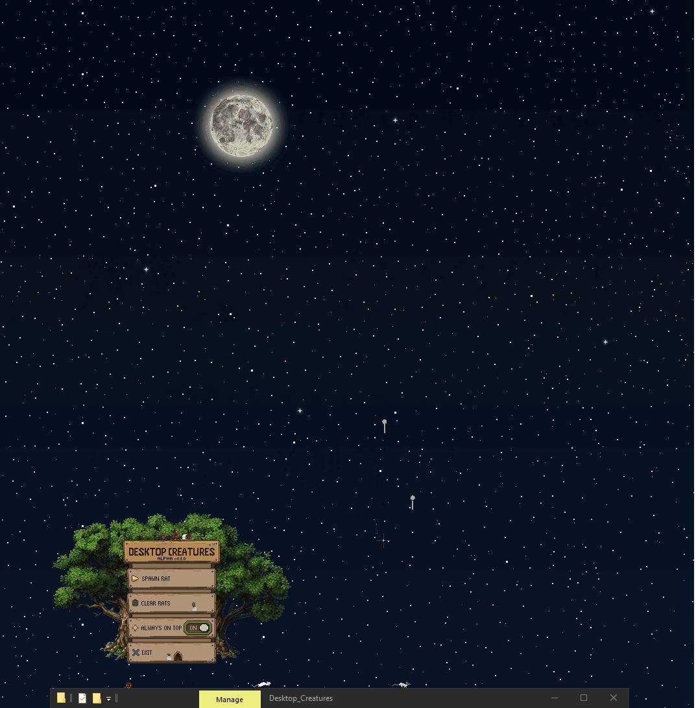

# Paulina's Fireworks

A tiny Windows desktop fireworks overlay that turns your monitor into a personal fireworks show.

Built in C# with Windows Forms, Paulina's Fireworks launches randomized fireworks across the screen with colorful particle effects, sparkles, glints, subtle smoke, and layered sound effects.

## Features

- Randomized fireworks show
- Multiple firework shapes and behaviors
- Color palettes and color styles
- Sparkling particle glints
- Ember color fading
- Subtle launch smoke
- Launch, explosion, crackle, and finale sounds
- Primary monitor fullscreen overlay
- Keyboard controls

## Controls

- **Space** AND/OR **MouseClick** — Launch a firework manually
- **F** — Toggle finale mode
- **P** — Pause / resume
- **G** — Toggle glow/glints
- **T** — Toggle always-on-top
- **Esc** — Exit

## Notes

- Windows only
- Runs as a transparent fullscreen overlay on the primary monitor
- Best enjoyed over a dark desktop or night-sky wallpaper
- Sound effects are included in the release build

## Project Goals

This started as a small personal Fourth of July project and grew into a lightweight particle-based fireworks engine.

The goal was to create something joyful, atmospheric, and easy to run: a tiny desktop celebration for anyone who wants fireworks on demand.

## Technologies

- C#
- .NET
- Windows Forms
- NAudio
- GDI+ drawing
- Procedural particle effects

## Status

This is a small finished desktop toy/project. Future updates may add:

- Monitor selection
- More palettes
- More firework shapes
- Optional menu UI
- Background music

## Screenshots

## Credits

Created by **Paulina Grey**.

Sound effects are from free sound libraries and edited for use in this project.

## License

Free for personal use.
